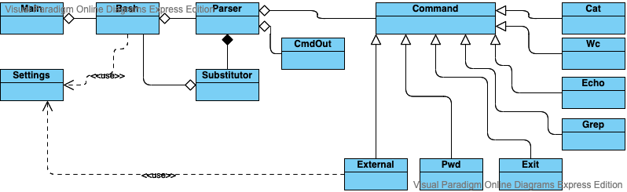
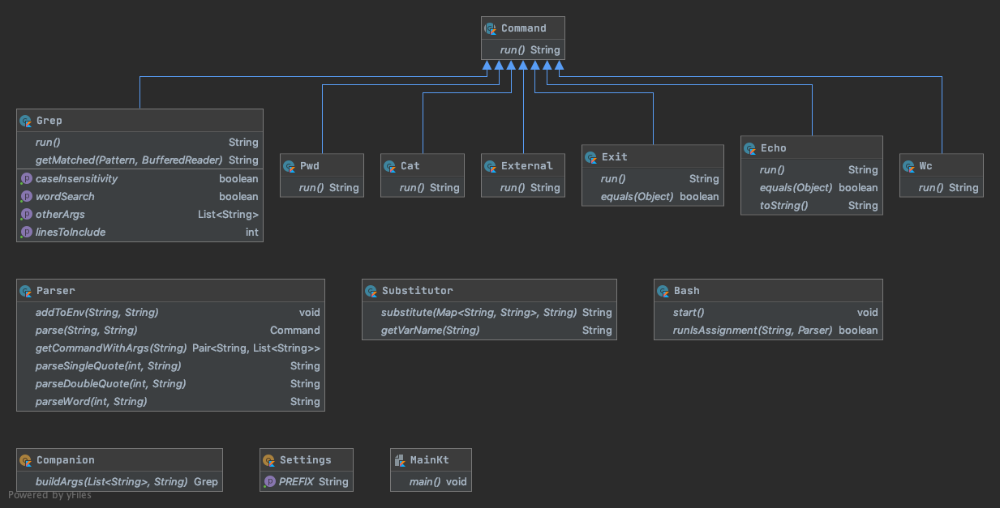

# bash
bash interpreter implementation on kotlin

### Implementation:

- Main function starting the main loop.
- Commands are separated by pipe. 
- Each command is parsed separately in `Parser.parse`. 
- At the time of parsing substitution is made by Substitutor.
- `Parser.parse` returns `Command`. Every child of `Command` abstract class has **run** method which is triggered in the main loop. 
- The stdOut of the last command is shown

#### `CmdOut` class
Each command  returns CmdOut.  
CmdOut.stdOut represents the command output. CmdOut.stdErr represents command error.  
If commands are piped the output of a previous command goes as an input for the next one.

Project diagram:

Class diagram:
